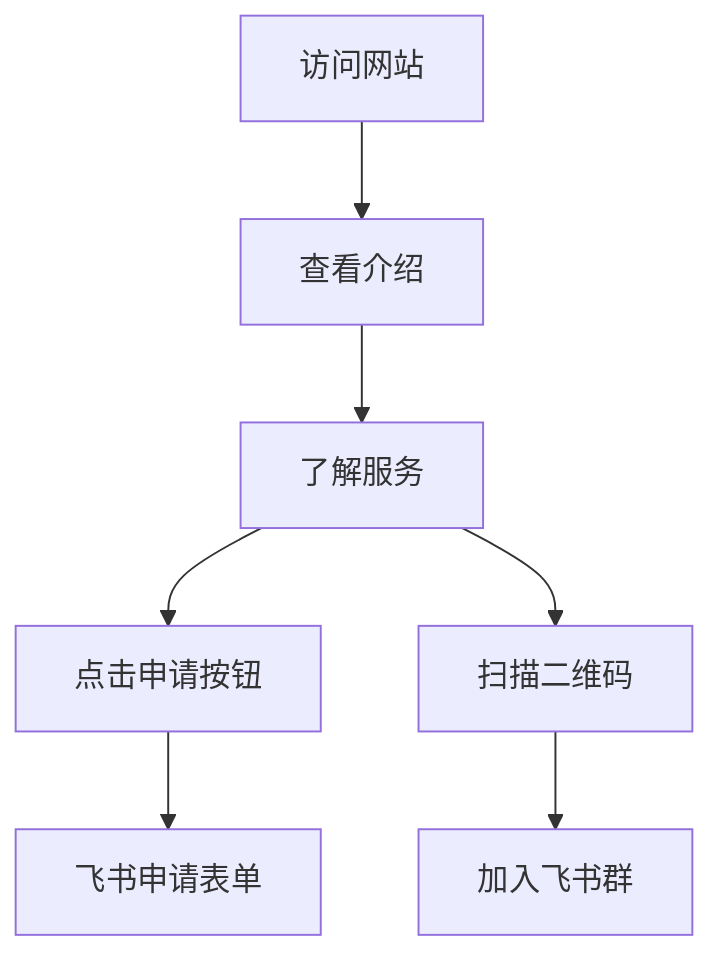

# AI产品市集网站 - 产品需求文档

## 1. 产品概述

AI产品市集网站（fpproductmarket.asia）是Founder Park发起的「AI产品市集」计划的官方单页展示平台，简洁明了地介绍计划内容并提供申请入口。

该网站通过单页面设计，快速向访问者传达AI产品市集的核心价值，并引导用户完成申请和加入社群。

## 2. 核心功能

### 2.1 用户角色

| 角色 | 访问方式 | 核心权限 |
|------|----------|----------|
| 访问者 | 直接访问网站 | 浏览所有内容，查看计划介绍 |
| 产品开发者 | 通过申请表单参与 | 提交产品信息，加入社群 |

### 2.2 功能模块

网站采用单页面设计，包含以下核心模块：
1. **Logo区域**：展示Founder Park品牌标识
2. **计划介绍**：简要说明AI产品市集计划的背景和价值
3. **申请链接**：飞书申请表单的直接链接
4. **社群二维码**：飞书群3群的加入二维码

### 2.3 页面详情

| 模块名称 | 功能描述 |
|----------|----------|
| Logo区域 | 展示Founder Park品牌logo，建立品牌认知 |
| 标题区域 | 显示"AI产品市集计划"主标题，突出核心主题 |
| 介绍内容 | 包含AI发展背景（DeepSeek、Manus、Agent等）和计划目标的精简介绍 |
| 服务说明 | 简要说明早期市场验证和产品推广两大核心服务 |
| 申请按钮 | 链接到飞书申请表单的醒目CTA按钮 |
| 二维码区域 | 展示飞书群3群二维码，方便用户扫码加入 |
| 注释说明 | 在二维码下方注明"产品市集飞书群3群二维码" |

## 3. 核心流程

用户在单页面上的操作流程：
1. 访问者进入网站查看logo和标题
2. 阅读AI产品市集计划的简要介绍
3. 了解提供的核心服务内容
4. 点击申请按钮跳转到飞书表单
5. 扫描二维码加入飞书社群

## 4. 用户界面设计

### 4.1 设计风格

- **主色调**：科技蓝#2563EB，辅助色橙色#F59E0B
- **按钮样式**：圆角按钮，渐变效果，悬停动画
- **字体**：中文使用思源黑体，英文使用Inter，主标题24px，正文16px
- **布局风格**：卡片式设计，顶部导航，响应式网格布局
- **图标风格**：线性图标，配合品牌色彩，支持AI和科技主题

### 4.2 页面设计概览

| 模块名称 | UI元素 |
|----------|--------|
| Logo区域 | Founder Park logo居中显示，适当大小保持品牌识别度 |
| 标题区域 | "AI产品市集计划"大标题，渐变文字效果，突出显示 |
| 介绍内容 | 简洁的文字排版，合理的行间距，重点内容加粗 |
| 服务说明 | 两个服务要点，简洁的图标+文字组合 |
| 申请按钮 | 醒目的CTA按钮，渐变背景，悬停动画效果 |
| 二维码区域 | 二维码图片居中显示，下方配有说明文字 |

### 4.3 响应式设计

网站采用移动优先的响应式设计，支持桌面端、平板和手机端访问，针对触屏设备优化交互体验，确保在各种设备上都能良好展示内容。