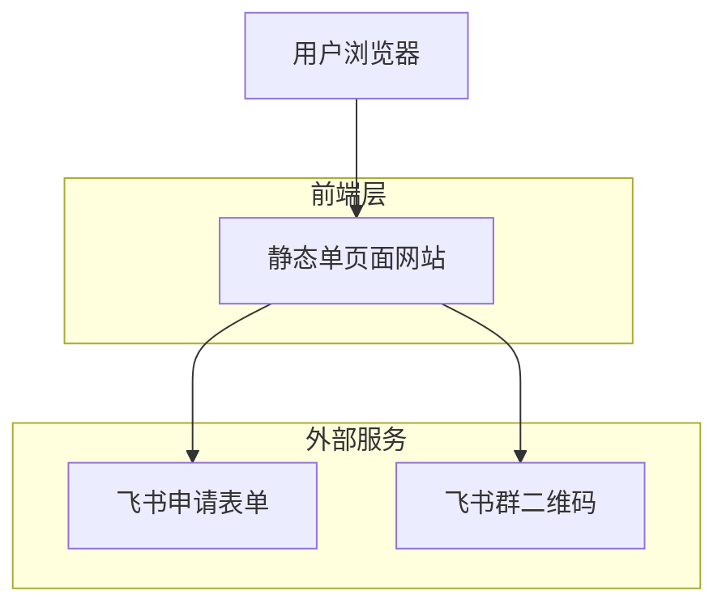

# AI产品市集网站 - 技术架构文档

## 1. 架构设计

## 2. 技术描述

* **前端**: HTML5 + CSS3 + 少量JavaScript

* **后端**: 无需后端服务

* **外部集成**: 飞书申请表单链接 + 飞书群二维码图片

## 3. 页面结构

单页面网站，包含以下区域：
- **Header**: Logo和标题区域
- **Main**: 介绍内容和服务说明
- **CTA**: 申请按钮区域
- **Footer**: 二维码和说明文字

## 4. 外部链接配置

### 4.1 飞书申请表单
- **链接地址**: 用户提供的飞书文档链接
- **打开方式**: 新窗口打开
- **按钮文字**: "立即申请加入"

### 4.2 飞书群二维码
- **图片格式**: PNG/JPG
- **显示尺寸**: 200x200px
- **说明文字**: "产品市集飞书群3群二维码"

## 5. 部署方案

静态网站可部署到以下平台：
- **GitHub Pages**: 免费静态网站托管
- **Netlify**: 支持自定义域名
- **Vercel**: 快速部署和CDN加速
- **传统服务器**: 直接上传HTML文件

